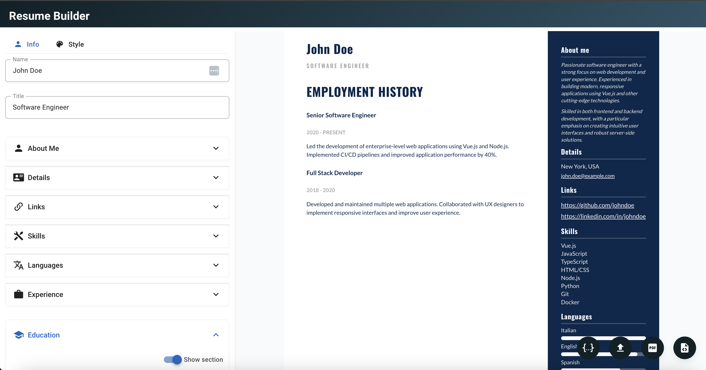

# Resume Builder

A modern, single-page resume builder application built with Vue 3 and Vuetify. Create professional resumes with a beautiful UI and export them as HTML, PDF or JSON.



## Features

- 🎨 **Modern UI**: Clean and intuitive interface built with Vuetify 3
- 📝 **Real-time Preview**: See your changes instantly with live preview
- 🔄 **Dynamic Sections**: Add, remove, and reorder sections as needed
- 🎯 **Customizable Details**: Flexible detail fields with link support
- 🎭 **Style Customization**: Customize colors, typography, and layout
- 💾 **Multiple Export Formats**: Download as HTML, PDF, or JSON
- 🔒 **Privacy First**: Everything stays in your browser
- 💾 **Save/Load**: Import and export your resume data as JSON
- 🤖 **AI CV Conversion**: Convert existing CVs using AI models
- 🔍 **Zoom Controls**: Zoom in/out for better editing experience
- 📱 **Mobile Responsive**: Works seamlessly on desktop and mobile devices
- 🎯 **Section Navigation**: Quick navigation between resume sections
- 📚 **CV Writing Guide**: Access to comprehensive CV writing resources

## Getting Started

### Prerequisites

- Node.js (v16 or higher)
- npm or yarn

### Installation

1. Clone the repository:
   ```bash
   git clone https://github.com/gianfrancodemarco/resume-builder.git
   cd resume-builder
   ```

2. Install dependencies:
   ```bash
   npm install
   # or
   yarn install
   ```

3. Start the development server:
   ```bash
   npm run dev
   # or
   yarn dev
   ```

4. Open your browser and navigate to `http://localhost:5173`

## Usage

### Creating Your Resume

1. **Personal Information**
   - Enter your name and title
   - Add a professional description
   - Include contact details (with optional links)

2. **Details Section**
   - Add location, email, and other contact information
   - Toggle link functionality for clickable details
   - Add or remove details as needed

3. **Skills & Languages**
   - List your technical skills
   - Add languages with proficiency levels
   - Show/hide sections as needed

4. **Experience & Education**
   - Add work experience with descriptions
   - Include education history
   - Add graduation marks and thesis information

5. **Custom Sections**
   - Create additional sections as needed
   - Organize content in a structured way

### Editor Features

- **Lateral Menu**: Quick access to all sections and export options
- **Real-time Preview**: See changes instantly in the preview panel
- **Zoom Controls**: Adjust zoom level for better editing experience
- **Section Navigation**: Jump to specific sections quickly
- **Mobile View**: Responsive design that adapts to mobile devices

### Customizing Style

- Choose from different color schemes
- Customize typography and fonts
- Adjust spacing and layout
- Toggle sidebar position (left/right)
- Modify background colors and borders

### Exporting Options

- **HTML**: Download a clean HTML version
- **PDF**: Export as PDF for printing and sharing
- **JSON**: Save your data for later editing and backup

### AI CV Conversion

- Upload existing CV files (PDF, DOC, etc.)
- Convert to structured resume format using AI
- Support for multiple AI models
- Automatic data extraction and formatting

## Technologies Used

- [Vue 3](https://vuejs.org/) - Progressive JavaScript framework
- [Vuetify 3](https://vuetifyjs.com/) - Material Design component framework
- [TipTap](https://tiptap.dev/) - Rich text editor
- [Phosphor Icons](https://phosphoricons.com/) - Icon library

## Contributing

Contributions are welcome! Please feel free to submit a Pull Request.

1. Fork the repository
2. Create your feature branch (`git checkout -b feature/AmazingFeature`)
3. Commit your changes (`git commit -m 'Add some AmazingFeature'`)
4. Push to the branch (`git push origin feature/AmazingFeature`)
5. Open a Pull Request

## License

This project is licensed under the MIT License - see the [LICENSE](LICENSE) file for details.

## Acknowledgments

- Icons by [Phosphor Icons](https://phosphoricons.com/)
- CV Writing Guide by [Guido Penta](https://github.com/GuidoPenta/galactic-CV-guide-for-developers)
- Inspiration from modern resume templates
